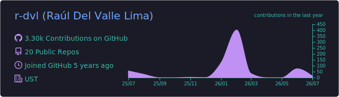
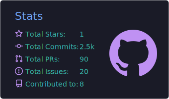
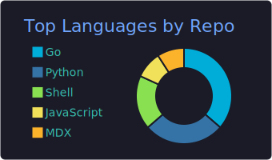
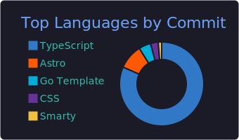
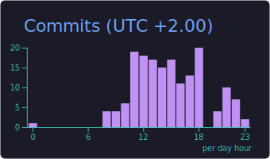

<h1 align="center">Hi there, I'm Raul (r-dvl) 👋</h1>

  <strong>Full-Stack Developer | Java Spring Boot and Angular Specialist | Musician and Photography Enthusiast</strong>

  
  

### About Me

---

I am a software developer passionate about building robust, efficient, and secure backend systems while maintaining clean, user-friendly frontend interfaces. I love solving logical challenges, designing databases, and structuring clean APIs.
- 🔭 **Current Projects**:
  - **[Bandanize](https://github.com/bandanize)**: A very useful tool for musicians who play with many different groups as session musicians.
  - **[Big Brother CCTV](https://github.com/big-brother-cctv)**: Microservices oriented CCTV ready to deploy in a Kubernetes environment.
  - **[Rastpics](https://github.com/rastpics)**: A responsive frontend Single Page Application (SPA) showcasing landscape photography, featuring modern typography and interactive visualization.
- ⚡ **Areas of Focus**: Software Architecture, Security, Testing, and Automation.

### GitHub Stats

---

  

  
  

  
  

  

  

